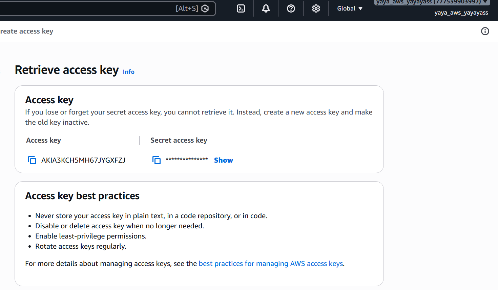
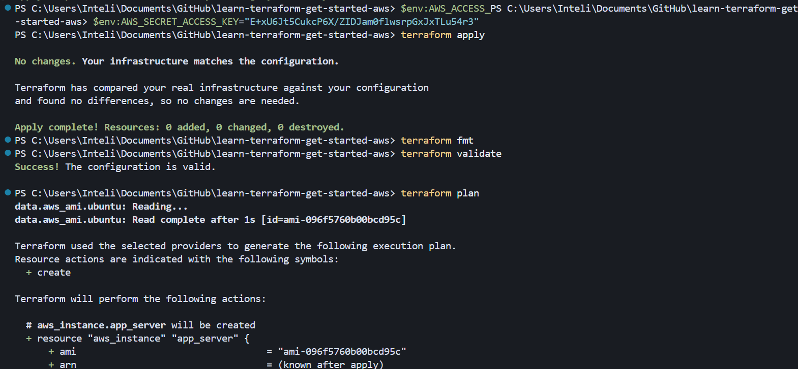
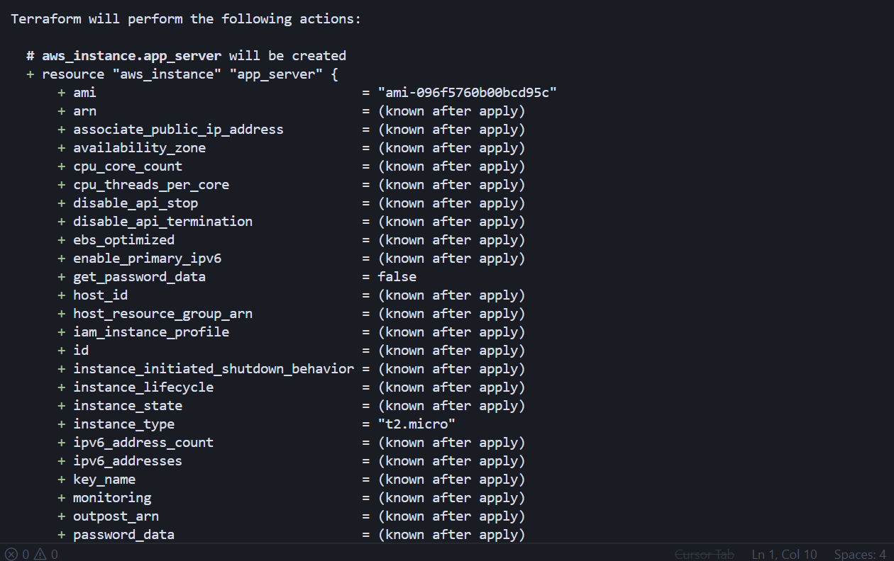
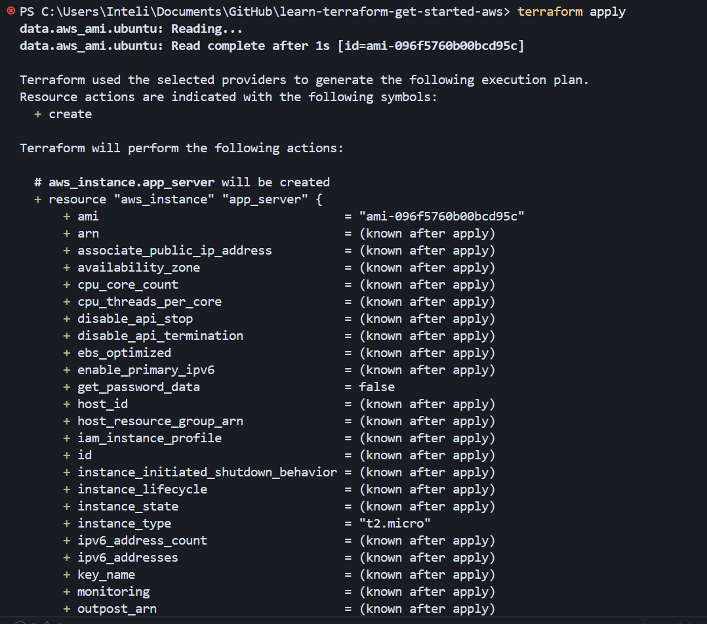
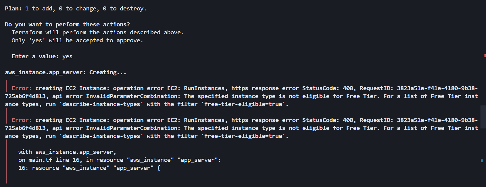
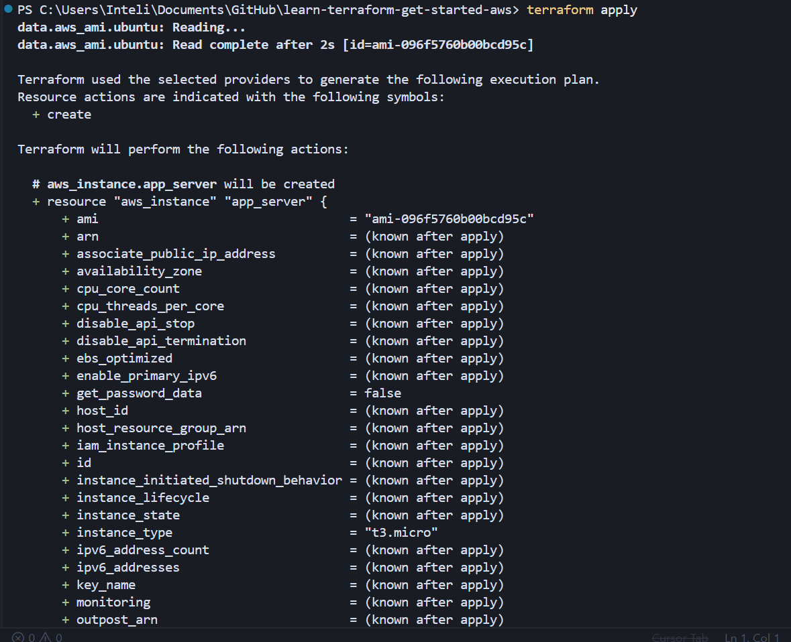
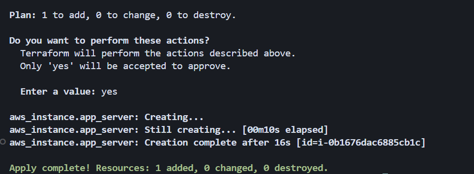
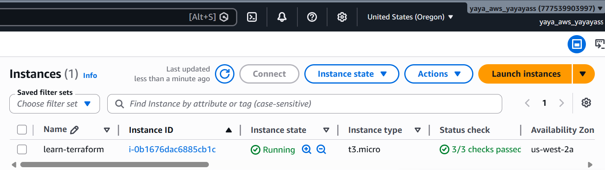
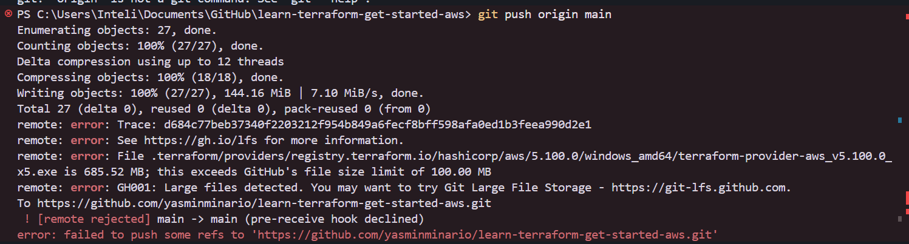
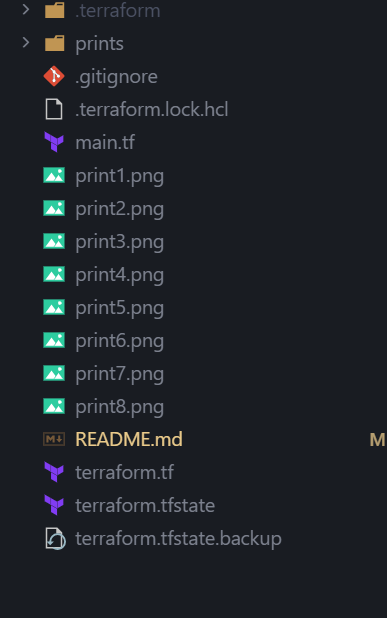

# Provisionando minha primeira instância EC2 com Terraform

Este repositório documenta o processo que eu segui para criar minha infraestrutura na AWS usando Terraform.

---

## Antes de tudo: credenciais na AWS

Antes de rodar qualquer comando, precisei criar credenciais de acesso programático no IAM. Fui no console da AWS, criei um usuário IAM e gerei uma Access Key com Access Key ID e Secret Access Key.



Depois disso, configurei as variáveis de ambiente no PowerShell para o Terraform conseguir se autenticar:

```powershell
$env:AWS_ACCESS_KEY_ID="..."
$env:AWS_SECRET_ACCESS_KEY="..."
```

---

## O que eu montei no projeto

Instalei o Terraform CLI (v1.15.6) e organizei a configuração em dois arquivos:

- `terraform.tf` — define a versão do Terraform e o provider AWS (`hashicorp/aws`, `~> 5.92`)
- `main.tf` — define o provider na região `us-west-2`, busca dinamicamente a AMI mais recente do Ubuntu 24.04 (Noble) e declara a instância EC2 `app_server`

A ideia do `data "aws_ami"` me chamou atenção: em vez de copiar e colar um ID de AMI que pode ficar desatualizado, o Terraform consulta a AWS e pega a imagem certa na hora, evitando hardcode.

---

## O que rolou no terminal

Os prints abaixo estão em ordem cronológica, é o que eu fui rodando e o que o terminal me devolveu.














### Print 1 — `terraform init`

Inicializei o workspace. O Terraform baixou o provider AWS e criou o `.terraform.lock.hcl` para fixar a versão do provider nas próximas execuções.

### Print 2 — `terraform fmt`

Formatei os arquivos `.tf` para seguir o padrão de estilo do HashiCorp.

### Print 3 — `terraform validate`

Validei a sintaxe e a consistência interna da configuração. Retornou sucesso.

### Print 4 — `terraform plan`

Rodei o plano de execução. O Terraform mostrou que ia criar 1 recurso: a instância `aws_instance.app_server`, com `instance_type = "t2.micro"` e a tag `Name = "learn-terraform"`.

### Print 5 — `terraform apply` (primeira tentativa — erro)

Confirmei com `yes` e a criação falhou. A AWS retornou:

> *The specified instance type is not eligible for Free Tier.*

O tutorial pedia `t2.micro`, que era o tipo clássico do free tier, mas na minha conta isso não funcionou por causa das mudanças no programa de Free Tier da AWS para contas mais novas. Não era problema de credencial nem de configuração do Terraform, era o tipo de instância que a AWS não aceitava no meu cenário.

---

## Conferindo no console da AWS

Com o apply finalizado, abri o console da EC2 e lá estava a instância rodando, com a tag learn-terraform, na availability zone `us-west-2a`.



---

## Publicando no GitHub

Depois de tudo funcionando, criei o repositório pela interface do Cursor e tentei dar `git push` pra `main`.

Eu tinha commitado tudo que estava na pasta do projeto — incluindo a pasta `.terraform/` e os arquivos `terraform.tfstate`. Só que quando rodei `terraform init`, o Terraform baixou o provider AWS pra dentro de `.terraform/`, e esse binário pesa uns 685 MB. O GitHub não aceita arquivo acima de 100 MB, então o push foi rejeitado:

> File .terraform/providers/.../terraform-provider-aws_v5.100.0_x5.exe is 685.52 MB; this exceeds GitHub's file size limit of 100.00 MB




| Arquivo/pasta | Por quê não commitar |
|---------------|----------------------|
| `.terraform/` | Providers baixados localmente pelo `terraform init` — cada pessoa baixa o seu |
| `*.tfstate` | Estado da infraestrutura, pode ter dados sensíveis e é específico do seu ambiente |
| `*.tfvars` | Pode conter secrets (credenciais, senhas) |

Criei um `.gitignore` com essas exclusões, tirei os arquivos grandes do commit e rodei o push de novo. Dessa vez foi.



---

## Notas finais

Eu não sabia que criar uma instância EC2 podia ser tão simples. Antes, eu imaginava que o processo seria todo feito pelo console da AWS, passando por etapas como escolha da AMI, tipo de instância, security group, armazenamento e configurações de rede.

Com o Terraform, bastou definir a infraestrutura em arquivos de configuração, executar `init`, `plan` e `apply`, e a instância foi provisionada. O comando `plan` ainda permitiu revisar as alterações antes da criação efetiva dos recursos. Quando encontrei um erro no tipo de instância escolhido, foi suficiente ajustar a configuração e executar o processo novamente.

O console continua sendo útil, mas Infrastructure as Code traz algumas vantagens importantes: as configurações ficam versionadas, podem ser reproduzidas com facilidade e servem como documentação do ambiente. Para quem está começando, isso torna o processo mais organizado e previsível.

---

## Estrutura do repositório

```
.
├── terraform.tf          # Versão do Terraform e provider AWS
├── main.tf               # Provider, data source da AMI e instância EC2
├── .terraform.lock.hcl   # Lock das versões dos providers
└── .gitignore            # Ignora .terraform/, tfstate, etc.
└── prints/               # Screenshots do processo
```

## Recursos criados

| Recurso | Detalhe |
|---------|---------|
| Instância EC2 | `aws_instance.app_server` |
| Tipo | `t3.micro` |
| Região | `us-west-2` |
| AMI | Ubuntu 24.04 Noble (buscada dinamicamente) |
| Tag | `Name = learn-terraform` |
